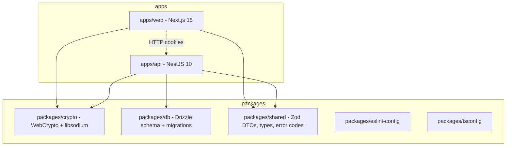
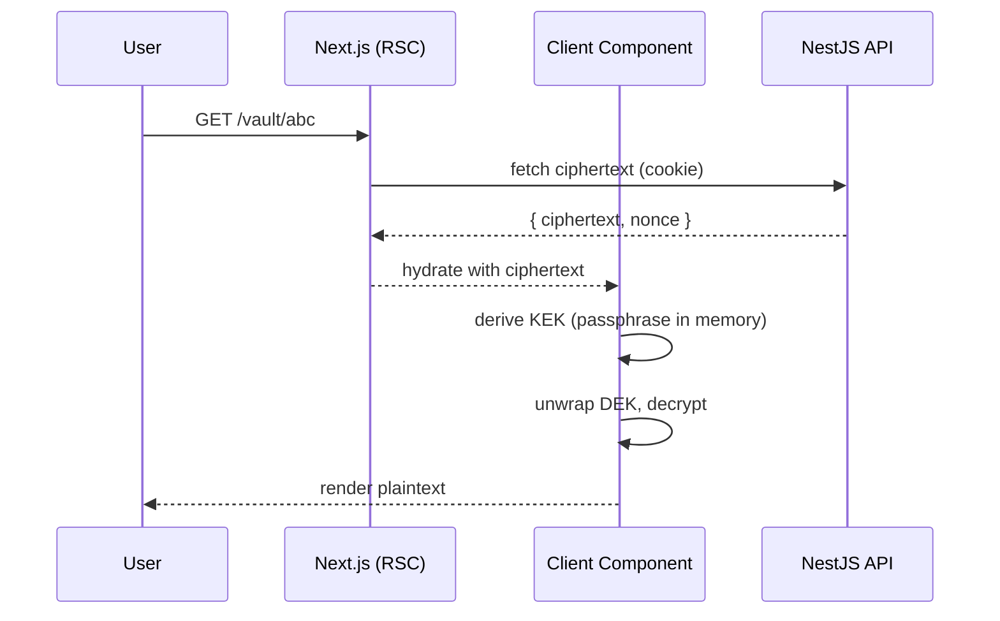
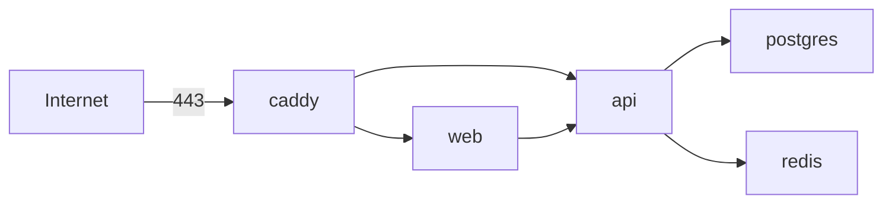

# SimpleVault — Architecture Research

> Self-hosted, end-to-end encrypted vault. Stack: **Turborepo + pnpm**, **NestJS** API, **Next.js 15 App Router** web, **PostgreSQL + Drizzle**, **Redis** (rate limiting), **Docker Compose** behind **Caddy** on a VPS.

This document fixes the high-level architecture before we cut a single line of code in `apps/` or `packages/`.

---

## 1. Monorepo Layout

We use **Turborepo + pnpm workspaces**. Turborepo gives us task graph caching (`turbo run build` only re-runs what changed); pnpm gives us strict, content-addressed installs and avoids the phantom-dependency problem in a hoisted layout.



Directory shape:

```
simplevault/
├── apps/
│   ├── web/                 # Next.js 15, App Router, RSC + client crypto
│   └── api/                 # NestJS 10, Fastify adapter
├── packages/
│   ├── crypto/              # universal: browser (WebCrypto) + node (libsodium)
│   ├── db/                  # drizzle schema, kit config, migrations/
│   ├── shared/              # Zod DTOs, error codes, branded types
│   ├── eslint-config/       # shared rules (next/nest/node variants)
│   └── tsconfig/            # base.json, nextjs.json, nestjs.json, library.json
├── turbo.json
├── pnpm-workspace.yaml
└── package.json
```

**Why each package?**

| Package | Reason |
|---|---|
| `apps/web` | Next.js owns rendering and is the *only* place plaintext lives. |
| `apps/api` | NestJS hosts ciphertext, sessions, audit chain. Never sees plaintext. |
| `packages/crypto` | Single source of cryptographic truth; auditing one package is feasible, auditing two divergent copies is not. |
| `packages/db` | Drizzle schema is shared between API runtime and migration tooling; isolating it lets us run `drizzle-kit` from CI without booting Nest. |
| `packages/shared` | Zod schemas double as runtime validators *and* the source of TS types for both client and server — kills DTO drift. |
| `packages/eslint-config` | One ruleset; Next/Nest variants extend it. |
| `packages/tsconfig` | Centralised `compilerOptions`; prevents `strict: false` slipping into a workspace. |

`turbo.json` pipeline (sketch):

```json
{
  "tasks": {
    "build":   { "dependsOn": ["^build"], "outputs": ["dist/**", ".next/**"] },
    "lint":    { "dependsOn": ["^build"] },
    "test":    { "dependsOn": ["^build"] },
    "dev":     { "cache": false, "persistent": true },
    "db:migrate": { "cache": false }
  }
}
```

---

## 2. Shared Crypto Package Design

`packages/crypto` must run in the browser (Next.js client components) **and** Node (server-side audit-chain verification only — server never decrypts user data). We achieve dual-runtime support with **conditional exports**.

```jsonc
// packages/crypto/package.json
{
  "name": "@simplevault/crypto",
  "type": "module",
  "sideEffects": false,
  "exports": {
    ".": {
      "types": "./dist/index.d.ts",
      "browser": "./dist/index.browser.js",
      "node":    "./dist/index.node.js",
      "default": "./dist/index.browser.js"
    },
    "./audit": {
      "types": "./dist/audit.d.ts",
      "browser": "./dist/audit.browser.js",
      "node":    "./dist/audit.node.js"
    }
  },
  "dependencies": {
    "libsodium-wrappers-sumo": "^0.7.13",
    "@scure/bip39": "^1.2.2",
    "@simplewebauthn/browser": "^10.0.0"
  }
}
```

Public surface (identical signatures, runtime-specific implementations):

| Export | Purpose |
|---|---|
| `deriveKey(passphrase, salt, params)` | Argon2id → 32-byte master key |
| `wrapKey(dek, kek)` / `unwrapKey(wrapped, kek)` | XChaCha20-Poly1305 key wrapping |
| `encrypt(plaintext, key, aad?)` / `decrypt(...)` | XChaCha20-Poly1305 AEAD |
| `randomBytes(n)` | `crypto.getRandomValues` / `crypto.randomBytes` |
| `bip39Generate(strength=256)` / `bip39ToSeed(mnemonic)` | Recovery phrase |
| `webauthnRegister()` / `webauthnAuthenticate()` | Browser-only (throws in node) |
| `chainHashCompute(prev, payload)` / `chainHashVerify(entries, hmacKey)` | Audit chain — node uses this for periodic verification |

Browser implementation prefers **WebCrypto** for AES/HKDF/HMAC and **libsodium** (WASM) for XChaCha20-Poly1305 + Argon2id. Node uses `node:crypto` + `libsodium-wrappers-sumo`. Both build to ESM.

---

## 3. API Design — REST + OpenAPI + shared Zod

**Decision: REST with OpenAPI, Zod schemas shared via `packages/shared`.**

Reasons over tRPC:
- Self-hosters expect a documented HTTP API for backups, mobile clients, CLI tools, third-party tooling.
- OpenAPI generates a typed client (`openapi-typescript`/`orval`) for `apps/web` *and* an inspectable contract.
- NestJS' `@nestjs/swagger` + `nestjs-zod` produces OpenAPI from the same Zod schemas the client validates against.
- tRPC couples client and server tightly — bad for an open self-hosted product.

**Auth transport:** httpOnly + Secure + SameSite=Strict cookies. No `Authorization` header (eliminates a whole class of XSS token-theft).

**CSRF:** SameSite=Strict cookies handle most cases; we add a **double-submit token** on state-changing routes — server issues a `X-CSRF-Token` cookie (readable by JS) and requires it echoed in the `X-CSRF-Token` header. The two must match and be HMAC-bound to the session.

---

## 4. Database Schema (Drizzle)

Convention: columns marked **[E]** are opaque ciphertext; the server has no key. Everything else is server-readable metadata.

```ts
// users
id uuid pk, email citext unique, email_verified bool,
auth_salt bytea,            // for KEK derivation
srp_verifier bytea?,        // optional SRP path
kek_check bytea,            // encrypted known-plaintext to verify passphrase
created_at, updated_at

// user_2fa_methods
id uuid pk, user_id fk, type enum('totp','webauthn','recovery'),
secret_enc bytea [E],       // TOTP secret wrapped with user KEK
created_at, last_used_at

// user_devices
id uuid pk, user_id fk, label text, fingerprint text,
created_at, revoked_at?

// user_sessions
id uuid pk, user_id fk, device_id fk,
refresh_token_hash bytea,   // sha256 of refresh JWT
parent_id uuid?,            // refresh-rotation lineage
issued_at, expires_at, revoked_at?, reuse_detected_at?

// vaults
id uuid pk, owner_id fk, name_enc bytea [E], created_at,
deletion_threshold smallint  -- m-of-n for shared vault delete

// vault_members
vault_id fk, user_id fk, role enum('owner','admin','member','viewer'),
wrapped_dek bytea [E],      -- vault DEK wrapped with member's pubkey
joined_at, primary key (vault_id, user_id)

// vault_invites
id uuid pk, vault_id fk, code_hash bytea, expires_at,
created_by fk, accepted_by fk?, accepted_at?

// credentials
id uuid pk, vault_id fk, ciphertext bytea [E], nonce bytea,
type_hint text,             -- 'login'|'card'|'note' (low-sensitivity)
updated_at, version int

// pages
id uuid pk, vault_id fk, parent_id uuid?, ciphertext bytea [E],
nonce bytea, page_password_hash bytea?,  -- argon2id, optional
updated_at, version int

// vault_delete_votes
vault_id fk, user_id fk, signed_at, signature bytea,
primary key (vault_id, user_id)

// audit_log
seq bigserial pk,
vault_id fk?, user_id fk?, action text, metadata jsonb,
prev_chain_hash bytea, chain_hmac bytea,    -- HMAC-SHA256 chain
created_at

// webauthn_credentials
id uuid pk, user_id fk, credential_id bytea unique,
public_key bytea, counter bigint, transports text[], created_at

// recovery_codes
user_id fk, code_hash bytea (argon2id),     -- one row per code
used_at?, primary key (user_id, code_hash)
```

Indexes: `vaults(owner_id)`, `credentials(vault_id, updated_at)`, `audit_log(vault_id, seq)`, `user_sessions(user_id, expires_at)`.

---

## 5. NestJS Module Breakdown

| Module | Controllers | Services | Responsibilities |
|---|---|---|---|
| `AuthModule` | `AuthController` (login, refresh, logout, 2fa/verify, webauthn/*) | `AuthService`, `SessionService`, `WebAuthnService` | Cookie issuance, refresh rotation + reuse detection, 2FA challenge |
| `UsersModule` | `UsersController` | `UsersService`, `RecoveryService` | Signup, email verify, recovery codes, KEK rotation |
| `VaultsModule` | `VaultsController` | `VaultsService` | CRUD vaults, list members, threshold-delete orchestration |
| `CredentialsModule` | `CredentialsController` | `CredentialsService` | Read/write encrypted blobs scoped to a vault |
| `PagesModule` | `PagesController` | `PagesService` | Encrypted pages, optional per-page password gate |
| `SharingModule` | `InvitesController`, `MembersController` | `InvitesService`, `RewrapService` | Invite codes, accept-flow that re-wraps the vault DEK to the new member's pubkey |
| `AuditModule` | `AuditController` (read-only export) | `AuditService` | Append entries to hash chain, verify integrity, periodic chain check job |
| `RateLimitModule` | (global guard) | `ThrottlerStorageRedis` config | Tiered throttling buckets |
| `HealthModule` | `HealthController` | — | `/healthz`, `/readyz`, DB+Redis pings |

---

## 6. Next.js App Router Structure

```
apps/web/src/app/
├── (auth)/
│   ├── login/page.tsx
│   ├── signup/page.tsx
│   └── recover/page.tsx
├── (app)/
│   ├── vault/[id]/page.tsx
│   ├── page/[id]/page.tsx
│   ├── settings/
│   │   ├── security/page.tsx
│   │   ├── sessions/page.tsx
│   │   ├── recovery/page.tsx
│   │   └── 2fa/page.tsx
│   └── shared/[vault_id]/
│       ├── members/page.tsx
│       ├── invites/page.tsx
│       └── deletion/page.tsx
└── api/                     # only for thin BFF helpers (CSRF token, etc.)
```

**Hard rule:** all crypto runs in client components (`"use client"`). RSC fetches ciphertext via the API and hands it down as props; a client component imports `@simplevault/crypto` and decrypts in the browser. The Next.js Node runtime never sees an unwrapped DEK.



---

## 7. Session & Token Strategy

- **Access token:** JWT, **RS256** (asymmetric — lets future read-only services verify without the signing key), **15 min** TTL, in a `sv_at` httpOnly cookie.
- **Refresh token:** opaque random 256-bit value, hashed (sha256) at rest, **30 day** TTL, `sv_rt` httpOnly+Secure+SameSite=Strict cookie.
- **Rotation:** every refresh issues a new refresh token and marks the old one consumed (`revoked_at`). The new row's `parent_id` points to the consumed one.
- **Reuse detection:** if a refresh token already marked `revoked_at` is presented, we walk the `parent_id` lineage and revoke **every** session in that family, set `reuse_detected_at`, write an audit entry, and force re-login. This is the canonical compromise indicator (see RFC 6819 §5.2.2.3).

```ts
async function rotate(presented: string, userId: string) {
  const row = await db.query.userSessions.findFirst({
    where: eq(userSessions.refreshTokenHash, sha256(presented))
  });
  if (!row) throw Unauthorized();
  if (row.revokedAt) {
    await revokeFamily(row.id);            // kill the whole lineage
    await audit.write({ action: 'refresh_reuse', userId });
    throw Unauthorized();
  }
  const next = randomBytes(32);
  await db.transaction(async (tx) => {
    await tx.update(userSessions).set({ revokedAt: new Date() }).where(eq(userSessions.id, row.id));
    await tx.insert(userSessions).values({
      userId, deviceId: row.deviceId, parentId: row.id,
      refreshTokenHash: sha256(next),
      issuedAt: new Date(), expiresAt: addDays(new Date(), 30),
    });
  });
  return next;
}
```

---

## 8. Rate Limiting Strategy

`@nestjs/throttler` v6 with **Redis storage** (`@nest-lab/throttler-storage-redis`). Multiple named throttlers — pick per-route via `@Throttle({ name: limit })`.

| Tier | Limit | Endpoints |
|---|---|---|
| `ip-global` | 1000 / 15 min | every route (default guard) |
| `ip-login` | 5 / 15 min | `POST /auth/login`, `POST /auth/2fa/verify` |
| `ip-signup` | 3 / hr | `POST /auth/signup`, `POST /auth/email/resend` |
| `ip-recover` | 5 / hr | `POST /auth/recover/*` |
| `user-general` | 300 / 15 min | every authenticated route |
| `user-pwchange` | 3 / day | `POST /users/me/passphrase`, `POST /users/me/recovery/regen` |
| `user-invite` | 10 / day per vault | `POST /vaults/:id/invites` |
| `user-export` | 5 / day | `GET /vaults/:id/export`, `GET /audit/export` |

Buckets keyed `throttler:{tier}:{userId|ip}:{windowEpoch}`.

---

## 9. Docker Compose Architecture



Two networks: `frontend` (caddy ↔ web ↔ api ingress) and `backend` (api ↔ postgres ↔ redis). Postgres has **no `ports:` mapping** — only reachable via `backend`.

```yaml
services:
  caddy:
    image: caddy:2-alpine
    ports: ["80:80", "443:443"]
    volumes: [caddy_data:/data, caddy_config:/config, ./Caddyfile:/etc/caddy/Caddyfile]
    networks: [frontend]
    deploy: { resources: { limits: { cpus: "0.5", memory: 128M } } }

  web:
    build: { context: ., target: web }
    networks: [frontend]
    healthcheck: { test: ["CMD", "wget", "-qO-", "http://localhost:3000/api/healthz"] }
    deploy: { resources: { limits: { cpus: "1", memory: 512M } } }

  api:
    build: { context: ., target: api }
    networks: [frontend, backend]
    depends_on:
      postgres: { condition: service_healthy }
      redis:    { condition: service_healthy }
    healthcheck: { test: ["CMD", "wget", "-qO-", "http://localhost:4000/healthz"] }
    deploy: { resources: { limits: { cpus: "2", memory: 1G } } }

  postgres:
    image: postgres:16-alpine
    volumes: [pg_data:/var/lib/postgresql/data]
    networks: [backend]
    healthcheck: { test: ["CMD-SHELL", "pg_isready -U $$POSTGRES_USER"] }

  redis:
    image: redis:7-alpine
    command: ["redis-server", "--save", "", "--appendonly", "no"]
    networks: [backend]
    healthcheck: { test: ["CMD", "redis-cli", "ping"] }

volumes: { pg_data: {}, caddy_data: {}, caddy_config: {}, audit_archive: {} }
networks: { frontend: {}, backend: { internal: true } }
```

Caddyfile uses `vault.example.com { reverse_proxy web:3000 }` and `api.vault.example.com { reverse_proxy api:4000 }` — auto TLS via Let's Encrypt.

---

## 10. Migration Strategy

- **Tooling:** `drizzle-kit generate` (committed SQL files in `packages/db/migrations/`) + `drizzle-kit migrate` at runtime.
- **Runner:** a **dedicated one-shot init container** `api-migrate` runs `pnpm --filter @simplevault/db migrate` and exits 0. The `api` service `depends_on: { api-migrate: { condition: service_completed_successfully } }`. This avoids two API replicas racing on the same migration.
- **Backward compat policy:**
  - Migrations are **forward-only**; no down migrations in production.
  - Every release supports N and N-1 schemas for at least one minor version → expand/contract pattern: add column → deploy code that writes both → backfill → deploy code that reads new → drop old in next release.
  - Schema changes that touch encrypted blob layout require an explicit `version` bump on the affected row and client-side migration on read.

---

## 11. Observability

- **Logging:** `pino` with `nestjs-pino`. JSON output, ISO timestamps, `requestId` (from `X-Request-Id` or generated). Pino redaction config blocks: `req.headers.cookie`, `req.headers.authorization`, `*.passphrase`, `*.ciphertext`, `*.wrapped_dek`, `*.secret_enc`. **Encrypted blobs are never logged**, even at debug — they fingerprint users.
- **Correlation:** request ID propagated to outgoing DB queries via `pg` `application_name` and to audit entries.
- **Metrics:** `@willsoto/nestjs-prometheus` exposes `/metrics` on a private port (only scraped from `backend` net). Counters: `http_requests_total{route,status}`, `auth_login_failures_total`, `audit_chain_breaks_total`, `twofa_bypass_total` (must stay 0 — alert on any increment), `refresh_reuse_total`. Histograms: `http_request_duration_seconds`.
- **Dashboards (Grafana):**
  - *Traffic:* req/s, p50/p95/p99 latency per route.
  - *Errors:* 4xx/5xx rate, top failing routes.
  - *Security:* login failures per IP+user, refresh reuses, 2FA bypasses, audit chain break count (alert: > 0).
  - *Infra:* CPU/mem per container, Postgres connection pool saturation, Redis ops/s.
- **Alerts:** PagerDuty/email on `audit_chain_breaks_total > 0`, `twofa_bypass_total > 0`, sustained 5xx > 1%, refresh-reuse spike.

---

### Closing notes

The architecture optimises for two non-negotiable invariants:

1. **The server cannot decrypt user data** — enforced by the schema ([E] columns), the request flow (RSC never holds a key), and the package boundary (`@simplevault/crypto` is the only place key material flows).
2. **Compromise is detectable** — refresh reuse triggers session-family revocation; the audit log is a tamper-evident hash chain verified periodically by a server-side job using the node build of the same crypto package.

Everything else (Turborepo layout, module breakdown, rate-limit tiers) is in service of those two properties.
