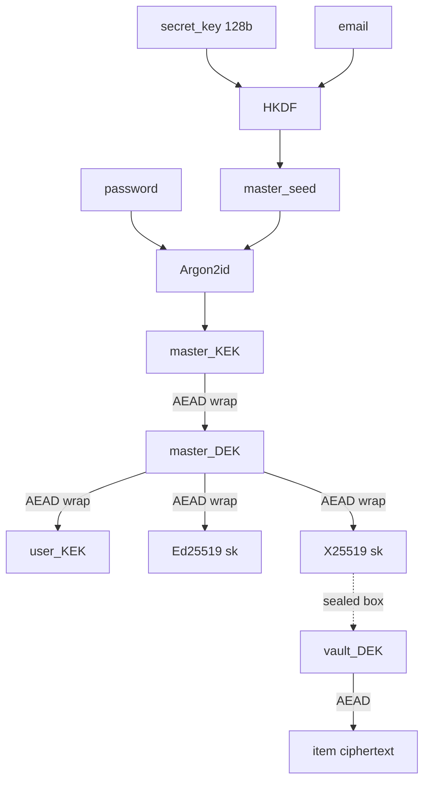
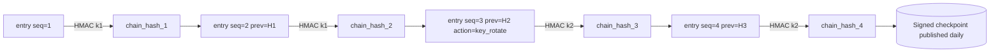

# SimpleVault — Cryptographic Stack & Key Management Research

> Status: research / decision document for v1
> Audience: implementers (Next.js 15 browser + NestJS server)
> Note: web fetching was unavailable during drafting; citations point to canonical primary sources to be re-verified before implementation freeze.

---

## 1. Browser crypto libraries

| Library | Algos | Bundle (gz) | Audit | Notes |
|---|---|---|---|---|
| **libsodium-wrappers** (sumo) | XChaCha20-Poly1305, Argon2id, Ed25519, X25519, BLAKE2b | ~190 KB sumo / ~110 KB core | NaCl + libsodium audited (Cure53, Private Internet Access 2017) | One-stop. WASM. Stable API. |
| **noble-ciphers + noble-hashes + @noble/post-quantum** | XChaCha20-Poly1305, AES-GCM, Argon2id (via `@noble/hashes/argon2`) | ~15–25 KB total tree-shaken | Audited by Cure53 (2024) | Pure JS, zero deps, modern. No WASM penalty. |
| **SJCL** (Stanford) | AES-CCM, PBKDF2, SHA-256 | ~30 KB | Old (last meaningful release 2019) | No Argon2, no XChaCha. Avoid for new builds. |
| **WebCrypto (`SubtleCrypto`)** | AES-GCM, AES-KW, HKDF, PBKDF2, ECDSA, ECDH | 0 KB | Browser-vendor implemented | **No XChaCha20, no Argon2id, no Ed25519 sign/verify in older browsers**. |

**WebCrypto gaps that matter for us:** no Argon2id, no XChaCha20-Poly1305, no Ed25519 (until very recent Safari/Chrome). So we cannot rely on it alone.

**Bitwarden's web vault** historically used SJCL + the WebCrypto API, then migrated to the Forge library and is now using a Rust→WASM SDK (`@bitwarden/sdk-internal`) for crypto primitives. Their KDF used PBKDF2-SHA256 (default 600,000 iters) and added Argon2id as an option in 2023 (see Bitwarden Security Whitepaper, "Encryption" / "KDF Algorithms" sections).

**Recommendation:** **`libsodium-wrappers-sumo`** for v1.
- Argon2id, XChaCha20-Poly1305, BLAKE2b, X25519, Ed25519 in one audited surface.
- API ergonomics: `crypto_aead_xchacha20poly1305_ietf_encrypt(...)` is hard to misuse (AEAD enforced).
- Bundle size (~110 KB gz core) is acceptable for an authenticated vault app loaded once. We can lazy-load it behind login.
- Fallback path: keep an abstraction layer so we can swap to noble in v2 if WASM bundle becomes a problem.

Primary sources: [libsodium docs](https://doc.libsodium.org/), [paulmillr/noble-ciphers](https://github.com/paulmillr/noble-ciphers), [Bitwarden whitepaper](https://bitwarden.com/help/bitwarden-security-white-paper/).

---

## 2. Argon2id parameters

OWASP Password Storage Cheat Sheet (2024) gives multiple acceptable profiles for Argon2id; the most commonly cited:
- `m = 19 MiB, t = 2, p = 1` (minimum)
- `m = 47 MiB, t = 1, p = 1`
- `m = 12 MiB, t = 3, p = 1`
- `m = 7 MiB, t = 5, p = 1`

RFC 9106 (Argon2) recommends `m = 2 GiB, t = 1, p = 4` for "first recommended" and `m = 64 MiB, t = 3, p = 4` for memory-constrained ("second recommended").

**Bitwarden** Argon2id default: `m = 64 MiB, t = 3, p = 4` (whitepaper, KDF section).
**1Password** does *not* use Argon2 — they still use PBKDF2-HMAC-SHA256 at 650,000 iterations (1Password Security Design, "Key derivation"), relying on their **Secret Key** as the dominant cost factor.

**Recommendation for SimpleVault v1:**

```
Default: Argon2id  m = 64 MiB,  t = 3,  p = 1
Floor (legacy/mobile): m = 19 MiB, t = 2, p = 1   (OWASP minimum)
```

`p = 1` because libsodium-wrappers in the browser runs Argon2id single-threaded (no Web Worker pool by default), and parallelism > 1 doesn't help in WASM single-thread.

**Calibration:** on first login from a new device, run `argon2id` with default params and measure wall time. Target band **500 ms – 1000 ms**. If under 500 ms, double `m` (cap at 256 MiB). If over 1500 ms, reduce `m` toward 19 MiB. **Persist the chosen `(m,t,p,salt)` tuple as part of the user record server-side** so every device uses identical params — otherwise wrapped keys won't decrypt. Only the server-stored profile is authoritative; client benchmark only runs at signup or on user-initiated re-key.

Primary sources: [OWASP PSCS](https://cheatsheetseries.owasp.org/cheatsheets/Password_Storage_Cheat_Sheet.html), [RFC 9106](https://datatracker.ietf.org/doc/html/rfc9106).

---

## 3. Key hierarchy

We adopt a **two-secret model** (1Password-style) layered over **per-user wrapping** (Bitwarden-style for sharing). Justification at the end of this section.

**Inputs**
- `password` — user-chosen, low entropy (~40–60 bits realistic)
- `secret_key` — 128-bit random, generated client-side at signup, displayed once and stored in the browser's IndexedDB; required on new-device login (re-entered)
- `email` (used as KDF salt domain separator with a per-user random `salt`)

**Derivation**

```
master_seed = HKDF-SHA256(
    ikm  = secret_key,
    salt = email_lowercased,
    info = "simplevault.v1.master_seed"
)                                                  # 32 B

master_KEK  = Argon2id(
    password = password,
    salt     = master_seed XOR user_argon_salt,    # server-stored salt
    m=64MiB, t=3, p=1, out=32B
)                                                  # 32 B  -- key-encryption key
```

`master_KEK` never leaves the device and never touches the server.

```
master_DEK  = random(32 B)              # at signup; encrypts user metadata
user_KEK    = random(32 B)              # at signup; receives shares from other users
user_signing = Ed25519 keypair          # at signup; for shared-vault invitations
user_kx      = X25519  keypair          # at signup; for sealed-box wrapping

wrapped_master_DEK   = XChaCha20-Poly1305(key=master_KEK, msg=master_DEK)
wrapped_user_KEK     = XChaCha20-Poly1305(key=master_DEK, msg=user_KEK)
wrapped_user_sign_sk = XChaCha20-Poly1305(key=master_DEK, msg=signing_sk)
wrapped_user_kx_sk   = XChaCha20-Poly1305(key=master_DEK, msg=kx_sk)
```

Per-vault keys:

```
vault_DEK  = random(32 B)                                  # one per vault
wrapped_vault_DEK_for_userA =
    crypto_box_seal(vault_DEK, recipient_pk = userA.kx_pk) # X25519 sealed box
```

Items inside a vault:

```
ciphertext = XChaCha20-Poly1305(
    key  = vault_DEK,
    msg  = canonical_json(item),
    nonce= random(24 B),
    ad   = vault_id || item_id || version
)
```

### Diagram



### Two-secret vs single-secret — recommendation

We **adopt the two-secret model**. Rationale for our threat model (targeted attacker, ≤50 users, self-hosted):

- A self-hosted server is a juicy single target. If the DB leaks, a single-secret model (Bitwarden-style) reduces attacker work to "Argon2id over a wordlist" — feasible against weak passwords even at 64 MiB/3 iters with rented GPUs.
- Adding a 128-bit `secret_key` makes the offline brute-force computationally infeasible (2^128 multiplier) regardless of password strength, exactly as 1Password's whitepaper argues ("Two secrets are better than one").
- Cost: users must transfer the secret key to new devices (QR / file). Acceptable for ≤50 users.

Primary sources: [Bitwarden whitepaper §Encryption/KDF](https://bitwarden.com/help/bitwarden-security-white-paper/), [1Password Security Design Whitepaper §"Two secrets"](https://1passwordstatic.com/files/security/1password-white-paper.pdf).

---

## 4. AEAD choice — XChaCha20-Poly1305 vs AES-256-GCM

| Property | XChaCha20-Poly1305 | AES-256-GCM |
|---|---|---|
| Nonce size | **192 bit** (random-safe) | 96 bit (random reuse risk after ~2³² msgs/key) |
| Browser native | No (libsodium WASM) | Yes (WebCrypto) |
| Software perf | Faster on devices without AES-NI | Faster on modern x86/ARM with HW AES |
| Side-channels | Constant-time by design (ARX) | Requires HW AES to be side-channel safe |
| Standardization | RFC 8439 + draft-irtf-cfrg-xchacha | NIST SP 800-38D |

**Recommendation: XChaCha20-Poly1305.** The 192-bit nonce lets us use `randombytes_buf(24)` per message without a counter, which removes an entire class of nonce-reuse bugs (critical because items will be re-encrypted often). Performance difference is negligible at our message sizes (vault items are <10 KB).

For server-side encryption-at-rest of *non-E2E* metadata (e.g., the audit log payloads), AES-256-GCM via Node `crypto` is fine — single writer, counter nonces.

---

## 5. Hash chain for audit log

**Entry format (canonical JSON, sorted keys, no whitespace):**

```json
{
  "seq": 12345,
  "ts": "2026-04-28T12:00:00.000Z",
  "actor": "user_id|null",
  "action": "vault.item.read",
  "payload_hash": "blake2b256(action_payload_json)",
  "prev_chain_hash": "<hex>"
}
```

**Chain step:**

```
chain_hash_n = HMAC-SHA256(
    key = audit_hmac_secret,
    msg = canonical_json(entry_n)        # entry_n already contains prev_chain_hash
)
```

### Why HMAC, not plain SHA-256

A plain hash chain (`h_n = SHA256(entry || h_{n-1})`) is tamper-evident only if the verifier *trusts* the latest hash. An attacker with DB write access can rewrite history end-to-end and recompute every hash. **HMAC** binds the chain to a secret the attacker (a DB-only adversary) does not have, so they cannot forge a valid continuation. This is the same reason Sigstore Rekor uses signed checkpoints over a Merkle tree, and why Certificate Transparency logs sign their tree heads (RFC 9162).

### HMAC key rotation

```
audit_hmac_secret = current secret in HSM/sealed env var
```

Rotation strategy: introduce a `key_id` field in each entry. On rotation, write a checkpoint entry `{action: "audit.key_rotate", from: kid_old, to: kid_new}` whose `chain_hash` is computed with the **new** key. Verifier walks the chain swapping keys at checkpoints. Old key must be retained read-only for verification of historical entries.

### Diagram



Daily we publish a signed `(seq_max, h_seq_max, ts)` checkpoint (Ed25519 over a separate offline key) so a complete-server-compromise attacker cannot silently rewrite the past — same trust pattern as CT's Signed Tree Heads.

Primary sources: [RFC 2104 (HMAC)](https://datatracker.ietf.org/doc/html/rfc2104), [RFC 9162 (CT v2)](https://datatracker.ietf.org/doc/html/rfc9162), [Sigstore Rekor docs](https://docs.sigstore.dev/logging/overview/).

---

## 6. WebAuthn

**Libraries:** `@simplewebauthn/server` and `@simplewebauthn/browser` (Mateo Hellín / Matthew Miller). As of 2026, the v10+ line is current and tracks WebAuthn Level 3. Mature, used by 1Password's Passage, etc.

Settings:
- **`userVerification: "required"`** — forces PIN/biometric, not just presence. Critical for a vault.
- **`residentKey: "preferred"`** — accept passkeys (discoverable credentials) so users can sign in without typing email, but allow legacy roaming authenticators.
- **`attestation: "none"`** — we don't need to identify the authenticator vendor; "direct" only adds privacy concerns.
- **`authenticatorAttachment`**: omit, to allow both platform (Touch ID) and cross-platform (YubiKey).

### Pitfalls
- **RP ID** must be the registrable domain (e.g., `vault.example.com` or `example.com`). It is fixed at credential creation; if you later move the app to a different subdomain, all credentials are bricked. Decide RP ID early; consider using the apex domain.
- The browser sends `origin`; verify it matches an allowlist server-side. `@simplewebauthn` does this if you pass `expectedOrigin` correctly behind a reverse proxy (don't trust `req.headers.host`).
- `userVerification` *must* be re-checked server-side in the verification step — the flag bit in the authenticator response is what counts, not your `options` request.
- Counter check: some platform authenticators always return `0`; do not block sign-in on counter==prev, only on counter regression with a non-zero value.

---

## 7. TOTP

| Lib | Maintained | API | Notes |
|---|---|---|---|
| **otplib** | Yes (active) | Modular (`@otplib/preset-default`) | RFC 6238 + RFC 4226 compliant. Pluggable HMAC backend. |
| speakeasy | Stagnant since 2017 | Monolithic | Still works but unmaintained. |
| node-2fa | Thin wrapper around speakeasy | Tiny | Inherits speakeasy's stagnation. |

**Pick `otplib`.** Configure:
- 30 s window, 6 digits, SHA-1 (Google Authenticator compatibility — SHA-256 is RFC-permitted but breaks many authenticator apps).
- **Drift tolerance:** `window: 1` (accept previous + current + next 30 s slot). Anything wider materially weakens 2FA.
- **Replay prevention:** store `(user_id, last_accepted_step)` in DB; reject any code whose computed step `<= last_accepted_step`. This blocks replay within the validity window.

Primary sources: [RFC 6238](https://datatracker.ietf.org/doc/html/rfc6238), [otplib](https://github.com/yeojz/otplib).

---

## 8. Recovery code (BIP39)

Use the `bip39` npm package (bitcoinjs). Generate **24 words = 256 bits of entropy + 8-bit checksum**. Display once at signup; require the user to confirm a subset (e.g., words 4, 11, 19) before continuing.

**Integration with key hierarchy:**

```
recovery_seed = bip39.mnemonicToSeed(mnemonic, "")  # 64 B PBKDF2 output (BIP39 spec)
recovery_KEK  = HKDF-SHA256(
    ikm  = recovery_seed,
    salt = user_id,
    info = "simplevault.v1.recovery_kek",
    L    = 32
)
wrapped_master_DEK_for_recovery =
    XChaCha20-Poly1305(key=recovery_KEK, msg=master_DEK)
```

The server stores `wrapped_master_DEK_for_recovery` alongside the password-wrapped copy. Recovery flow:

1. User supplies mnemonic → derive `recovery_KEK` → unwrap `master_DEK`.
2. Client immediately re-runs Argon2id with new password to compute new `master_KEK`, re-wraps `master_DEK`.
3. Old `wrapped_master_DEK` (password-derived) is replaced. Old recovery code is **invalidated** and a new one issued.

The `secret_key` (from §3) must also be re-displayed during recovery, so the recovery mnemonic alone (without the secret key) is *not* sufficient — preserves the two-secret invariant against pure mnemonic theft. Document this UX clearly.

**Storage:** server stores ONLY the wrapped DEK, never the mnemonic or its hash. We do not need to "verify" the recovery code at any time other than recovery itself; success is attested by successful AEAD decryption of the wrapped DEK.

Primary sources: [BIP-39](https://github.com/bitcoin/bips/blob/master/bip-0039.mediawiki).

---

## 9. Constant-time comparisons (mandatory list)

Use Node `crypto.timingSafeEqual(Buffer, Buffer)` (rejects unequal-length buffers — pre-pad if needed) or `sodium.memcmp` in browser.

Every place where user-controlled input is compared to a secret-derived value:

1. HMAC tag verification on audit chain entries (server).
2. TOTP code comparison (server) — `otplib.authenticator.check` already uses CT compare; verify in source.
3. WebAuthn challenge / signature checks — handled by `@simplewebauthn`, do not reimplement.
4. Session token / CSRF token comparisons.
5. Recovery-code-derived KEK validation (implicit via AEAD tag — but if we store a hash of mnemonic for "is this the right code?" UX hint, that hash compare must be CT).
6. Email-verification token, password-reset token comparisons.
7. API key comparisons for service tokens.
8. Webhook signature verification (if added).

Never use `===` or `Buffer.compare` for any of the above.

---

## 10. Common pitfalls

- **Nonce reuse with XChaCha20-Poly1305:** risk is *low* with a 192-bit random nonce (collision ≈ 2⁻⁹⁶ after 2⁴⁸ messages). Still: use `randombytes_buf(24)` per encryption, never derive nonces from item IDs (predictable across versions of the same item).
- **KDF parameter downgrade:** server stores `(m, t, p)`. Attacker with DB write could lower them to make brute-force cheap. Mitigation: include `(m, t, p)` in the AAD of `wrapped_master_DEK` so any tampering breaks decryption; client refuses to proceed if params are below a hard floor.
- **Recovery code at rest:** never store the mnemonic, never store its hash unless absolutely needed for UX. The wrapped DEK *is* the verifier.
- **Memory zeroing in JS:** essentially impossible. `Uint8Array.fill(0)` helps, but V8 may have copies in JIT slots, GC-old-gen, transferable buffers. Mitigations: minimise the lifetime of `master_KEK` (derive, unwrap, discard reference, force GC by leaving scope), never put plaintext keys in React state, never log them, prefer `crypto.subtle.importKey({extractable: false})` where applicable to keep raw bytes inside the browser's crypto subsystem.
- **What to log:** request id, user id, action verb, vault id, item id, outcome (ok / denied), latency, IP (hashed), UA family.
- **What to NEVER log:** plaintext or ciphertext of items, keys (any level), passwords, mnemonics, secret_key, TOTP secrets/codes, WebAuthn challenges, full cookies/JWTs, full IPs (hash or truncate).
- **Error messages:** generic on auth failure ("invalid credentials"). Do not differentiate "no such user" vs "wrong password" — username enumeration leak.

---

## Recommended choices for SimpleVault — summary

| Concern | Choice |
|---|---|
| Browser crypto | `libsodium-wrappers-sumo` (lazy-loaded post-login) |
| Server crypto | Node `crypto` (AES-GCM, HMAC-SHA256, HKDF) + `libsodium-native` if XChaCha needed server-side |
| KDF | Argon2id, default `m=64 MiB, t=3, p=1`; floor `m=19 MiB, t=2, p=1`; per-user calibrated to ~750 ms |
| Two-secret model | Yes — 128-bit `secret_key` + password (1Password-style) |
| AEAD | XChaCha20-Poly1305 (24-byte random nonce) |
| Per-user wrapping | X25519 sealed box of `vault_DEK` per recipient |
| Audit log | HMAC-SHA256 chain + daily Ed25519-signed checkpoint |
| WebAuthn | `@simplewebauthn` v10+, `userVerification: required`, `residentKey: preferred`, `attestation: none` |
| TOTP | `otplib`, SHA-1, 6 digits, 30 s, `window:1`, server-stored last-step replay guard |
| Recovery code | `bip39` 24 words, derives `recovery_KEK` that wraps `master_DEK`; secret_key still required |
| CT compare | `crypto.timingSafeEqual` everywhere user input meets a secret |

**Primary sources to re-verify before freeze:**
- Bitwarden Security Whitepaper — https://bitwarden.com/help/bitwarden-security-white-paper/
- 1Password Security Design — https://1passwordstatic.com/files/security/1password-white-paper.pdf
- OWASP Password Storage Cheat Sheet — https://cheatsheetseries.owasp.org/cheatsheets/Password_Storage_Cheat_Sheet.html
- RFC 9106 (Argon2), RFC 8439 (ChaCha20-Poly1305), RFC 6238 (TOTP), RFC 4226 (HOTP), RFC 9162 (CT v2), RFC 2104 (HMAC), BIP-39
- libsodium docs — https://doc.libsodium.org/
- WebAuthn L3 — https://www.w3.org/TR/webauthn-3/
